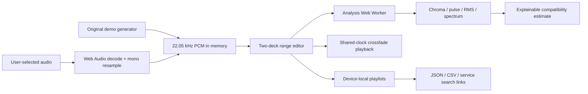

# SeemLess — Transition Studio

A browser-based audio workbench for finding the right connection between two songs. Choose an outgoing excerpt, choose an incoming excerpt, adjust the crossfade, and hear the transition immediately.

**Status: functional prototype.** The compatibility score uses digital signal processing, not a trained deep-learning model. Spotify and Apple Music currently use manual search handoffs, not connected playlist synchronization.

## Try it

Requires **Node.js 22+**. There are no package dependencies and no API keys.

```sh
git clone https://github.com/alex-sviriduk/seemless-transition-studio.git
cd seemless-transition-studio
npm start
```

Open [localhost:4173](http://127.0.0.1:4173). The initial pair uses original, synthesized demo audio, so you can immediately click **Preview transition**. To use your own music, open **Audio library**, choose an audio file, then select **Use A** or **Use B**. Use files you are authorized to process.

The project is static: `dist/` contains authored application source, not generated output. Serve that directory over HTTP(S); opening `index.html` as a file will not reliably load ES modules or workers.

## What works

- Two independent decks with file selection, waveform visualization, numeric excerpt boundaries, and range sliders.
- Browser decoding of supported MP3, WAV, M4A, OGG, and FLAC files. Exact codec support depends on the browser.
- A shared Web Audio clock for scheduling both excerpts, with linear or equal-power fades and a hard-cut option.
- Playback progress, stop behavior, master volume, and compressor/headroom to reduce overload.
- Background feature extraction in a Web Worker, with stale-result rejection when selections change.
- A 0–100 compatibility estimate using chroma, pulse, RMS loudness, and spectral texture.
- Local playlists storing ordered pairs, excerpt ranges, fade settings, and the score method; CSV/JSON exports and reload into the studio.
- Manual song search links to Spotify and Apple Music for uploaded tracks.
- Four deterministic, original demo loops; no commercial recordings or copyrighted artwork are bundled.
- Responsive layout, semantic controls, keyboard input, native dialogs, and optional WebMCP range configuration.

## Architecture



| File | Responsibility |
| --- | --- |
| `dist/app.js` | UI, file loading, playback, playlists, worker coordination |
| `dist/audio.js` | Pure DSP, transition timing, fade curves, original demo synthesis |
| `dist/analysis-worker.js` | Feature extraction off the main thread |
| `dist/style.css` | Responsive studio interface |
| `test/audio.test.js` | Deterministic tests for timing and signal behavior |
| `scripts/serve.mjs` | Dependency-free local HTTP server |

See [architecture and tradeoffs](docs/ARCHITECTURE.md) and the [scoring method](docs/SCORING.md).

## Test

```sh
npm run check
npm test
```

Tests cover scheduling arithmetic, range validation, fade invariants, known-frequency FFT recovery, silence rejection, generated-tempo recovery, identical-audio behavior, a related-versus-contrasting demo comparison, loudness changes, and missing-pulse handling. These are engineering checks, **not a human evaluation of transition quality**. GitHub Actions runs syntax checks and tests on pushes and pull requests.

## Scope and limitations

The score is a heuristic and is not calibrated to human preference. It does not perform beat alignment, time stretching, pitch shifting, phrase detection, melodic sequence comparison, or genre-independent musical key recognition. Crossfade settings affect playback but not the feature score. Uploaded audio is downmixed to mono at 22.05 kHz for both analysis and preview; preserving original stereo playback is a documented next step.

Audio is kept in memory only; reselect files after reloading. Playlists live in this browser's `localStorage`, are not encrypted or account-synced, and can be lost if browser data is cleared. Exports preserve metadata, not audio. A maximum of 12 in-memory tracks (including four demos), 60 MB per input file, and 15 minutes per decoded track keeps this prototype bounded; long compressed files may still require substantial decode memory.

No trained model, OAuth flow, backend, telemetry, automatic catalog matching, or direct service playlist write is claimed. Google Fonts may make network requests for typography; audio processing itself stays local. See the [roadmap](docs/ROADMAP.md) for a concrete next-phase plan.

## Portfolio walkthrough

1. Start with the default demo pair and inspect the score explanation.
2. Preview the transition and adjust the fade.
3. Change an excerpt and observe the score update without blocking the controls.
4. Try the contrasting pair and explain which features account for the difference.
5. Save the transition to a named playlist and export its reproducible settings.
6. Explain why a signal-based baseline precedes a learned model and why streaming audio is separated from playlist metadata.

See [interview notes and suggested résumé wording](docs/PORTFOLIO.md). Avoid claiming measured user adoption, model accuracy, or external integrations that have not been built and evaluated.

## References

- [Web Audio API](https://developer.mozilla.org/en-US/docs/Web/API/Web_Audio_API)
- [Spotify Developer Policy](https://developer.spotify.com/policy): streamed Spotify content must not be mixed or ingested into ML models.
- [Spotify Authorization Code with PKCE](https://developer.spotify.com/documentation/web-api/tutorials/code-pkce-flow)
- [Apple MusicKit](https://developer.apple.com/musickit/)

No third-party music, secrets, or user-uploaded audio belongs in this repository.
