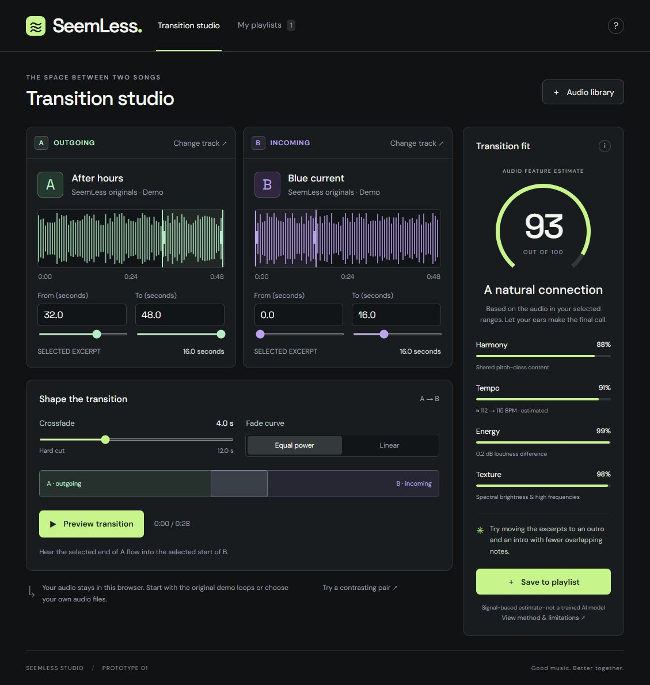

# Validation record

Validated on 2026-09-23.

## Automated

- JavaScript syntax checks pass for the app, audio module, worker, and local server.
- All **11 Node test cases pass**, covering timing, range rejection, fade invariants, FFT recovery, silence/short-input handling, half/double-time pulse ambiguity, identity, contrast, loudness, and missing tempo.

## Browser checks

In the Codex Chromium-based browser:

- Initial demo waveforms and analysis render; default pairing estimates 93/100.
- Valid WebMCP range configuration changes the visible numeric inputs. Invalid out-of-bounds ranges reject before mutation.
- Preview enters the playing state and Stop returns the transport to idle.
- A locally generated 8-second WAV imports, decodes, appears in the library, loads into deck A, and enters playback successfully.
- Saving a named playlist shows the saved pair and metadata; loading it restores the selected ranges.
- Playlist metadata persists after page reload.
- Full-page desktop layout was inspected; the screenshot is included below.

No listening-quality study was performed. These checks confirm scheduling/UI behavior, not perceived musical quality. External music services and a learned model are not connected. Codec coverage beyond the generated WAV, screen-reader testing, reliable mobile viewport verification, and live provider API tests remain open.

